<link href="http://kevinburke.bitbucket.org/markdowncss/markdown.css" rel="stylesheet"></link>


# Step 06 - Calculating Secondary Structure

Calculation of Secondary structure is an important part of the analysis. I will output the data to a FASTA file and output two types of data. 

* **Rolling Window** - I will calculate local secondary structure in a 40 bp rolling window across the transcript, in a similar fashion to the Nevan & Pilpel Genome Biology paper
* **5' Portion of Transcript** - I will calculate the ensemble delta-G for the transcript up to the first 30 bases of the CDS (as in the 202 analysis), starting at the most prevalent transcription start site per library member. 

## Extract sequences to FASTA

### Extract sequence up to 30 bp into CDS

I will make one file, called `transcripts.fasta` for whole transcripts, and another, `trans_windows.fasta` for 40 base-pair transcript windows. To will slide the windows every 


```r
seqs <- with(lib_seqs, paste(as.character(Promoter.seq), as.character(RBS.seq), 
    as.character(CDS.seq), sep = ""))

seqs.df <- data.frame(Name = lib_seqs$Name, Seq = seqs)
seqs.df <- merge(seqs.df, ngs[, c("Name", "Offset.RBS.Best")], by = "Name", 
    all.x = T)

# Fill in NA offsets (those with no RNA) with -5, which is the most common
# TSS position.
seqs.df$Offset.RBS.Best[is.na(seqs.df$Offset.RBS.Best)] <- -5

# Generate whole-transcript FASTA sequences
seqs.df$Seq.Transcript <- with(seqs.df, substring(Seq, 40 + Offset.RBS.Best))
seqs.string <- with(seqs.df, paste(">", Name, "\n", Seq.Transcript, 
    sep = "", collapse = "\n"))
write(seqs.string, file = "data/transcripts.cds30.fasta")
```


I saved the sequences to `data/transcripts.cds30.fasta`. 

### Extract 40 bp windows across transcript

I will slice all the transcripts into 40 bp windows and compute the free energy scores for each separately. To save on computation time, I will create a lookup table to avoid calculating energies for redundant 40-mers. 

I decided on 40-mer windows because that's the size that other papers use, although this can be changed in the code.

Beause the ribosome binding sites are all different lengths (18-21 bases long), I would prefer to line up the window calculations at the ATG of the coding sequence. 

I will center each window and begin 30 bases into the promoter, so as to include the last 10 bases of the promoter and the 5-base promoter barcode. I chose this position, corresponding to -15 in my Offset.RBS scheme, because `97.2%` of constructs begin at least there, if not later into the promoter. I am lining everything up at the ATG start codon, so if I go 21 + 15 back from the ATG, all of them will have at least this much of the promoter, if not 3 extra bases.

I will go up to 40 bases into the GFP sequence as well. I there is a CAT before the middle ATG of the GFP, corresponding to the cut site, which I put in lower case. 

The full sequences are at all between `NaN &times; 10<sup>Inf</sup>` and  `NaN &times; 10<sup>Inf</sup>` bases long. If we start 40 - 5 + 15 = 30 ( Length - Promoter - Barcode + Offset ) bases in, we will have between 92 and 95 bases of transcript. Because all of the sequence have slightly different starting positions, some will include a few more bases of GFP than others. 

```
>Downstream GFP sequence
catatgCGTAAAGGCGAAGAGCTGTTCACTGGTTTCGTCACTATTCTGGTGGAACTGGATGGT...
```


```r
# Add GFP sequencez`z`
seqs.df$Seq.Full <- with(seqs.df, paste(Seq, "catatgCGTAAAGGCGAAGAGCTGTTCACTGGTTTCGTCACTATTCTGGTGGAACTGGATGGT", 
    sep = ""))

# Add translation start site offset. We add + 1 since it is inclusive
seqs.df <- merge(seqs.df, with(lib_seqs, data.frame(Name = Name, 
    Offset.ATG = nchar(as.character(RBS.seq)) + nchar(as.character(Promoter.seq)) + 
        1)))

# Generate whole-transcript FASTA sequences
slice_window <- function(i, seqs, width) {
    return(unlist(substring(seqs, i - floor(width/2) + 1, i + floor(width/2))))
}

# given a window width, this takes the sequence dataframe and makes
# window. It writes them to a file, and also returns a dataframe with the
# windows for later correlation.
get_window_dataframe <- function(window.width) {
    
    # start windowing 15 + 21 bases before the ATG (15 before promo end, 21 is
    # size of longest RBS)
    toWindow <- with(seqs.df, substring(Seq.Full, Offset.ATG - 15 - 21))
    
    # make windows
    window.start <- floor(window.width/2) + 1
    window.end <- nchar(toWindow[1]) - ceiling(window.width/2)
    window.count <- length(window.start:window.end)
    window <- lapply(window.start:window.end, slice_window, toWindow, window.width)
    window <- matrix(do.call(cbind, window), ncol = window.count)
    
    # list of window positions
    window.pos <- floor(seq(0, (length(window) - 1))/length(lib_seqs$Name)) + 
        window.start - 15 - 21
    
    # make window df
    window.df <- data.frame(Window = factor(window[1:length(window)]), Name = seqs.df$Name, 
        Pos = window.pos)
    
    # make FASTA string of windows
    window.string <- with(window.df, paste(">Win", 1:length(levels(Window)), 
        "\n", levels(Window), sep = "", collapse = "\n"))
    
    # save window string
    write(window.string, file = paste("data/windows", window.width, "fasta", 
        sep = "."))
    
    # return window dataframe
    return(window.df)
}

window.df.40 <- get_window_dataframe(40)
window.df.20 <- get_window_dataframe(20)
```


## Run UNAFold and load free energy calculations


```r
# Don't run this one in knitr because it will take forever... (~ 1 min)
# system(paste('hybrid-ss-min --NA=RNA -E
# --output=data/transcripts.cds30', 'data/transcripts.cds30.fasta'),
# ignore.stdout = T)

seqs.df$dG <- read.table("data/transcripts.cds30.dG", header = F, 
    sep = "\t", colClasses = c("NULL", "numeric", "NULL"))[, 1]

ngs <- merge(ngs, seqs.df[, c("Name", "dG")])
ngs$dG[is.na(ngs$RNA)] <- NA

# Don't run this one in knitr because it will take forever... (5-10 min)
# system(paste('hybrid-ss-min --NA=RNA -E --output=data/windows.40',
# 'data/windows.40.fasta'), ignore.stdout = T) system(paste('hybrid-ss-min
# --NA=RNA -E --output=data/windows.20', 'data/windows.20.fasta'),
# ignore.stdout = T)

add_dG_to_window_dataframe <- function(window.df, window.width) {
    window.dG.file <- paste("data/windows", window.width, "dG", sep = ".")
    window.dG <- data.frame(Window = levels(window.df$Window), dG = read.table(file = window.dG.file, 
        header = F, sep = "\t", colClasses = c("NULL", "numeric", "NULL"))[, 
        1])
    
    # dG should not exceed 5.
    window.dG$dG[window.dG$dG > 5] <- 5
    
    return(merge(window.df, window.dG, by = "Window"))
}

window.df.40 <- add_dG_to_window_dataframe(window.df.40, 40)
window.df.20 <- add_dG_to_window_dataframe(window.df.20, 20)
```


## Exploring Secondary Structure Transcript Co-Variation

First, let's take a look at a histogram of secondary structure:


```r
ggplot(ngs, aes(x = dG)) + geom_bar() + theme_bw() + scale_x_continuous(name = "Number of Sequences")
```

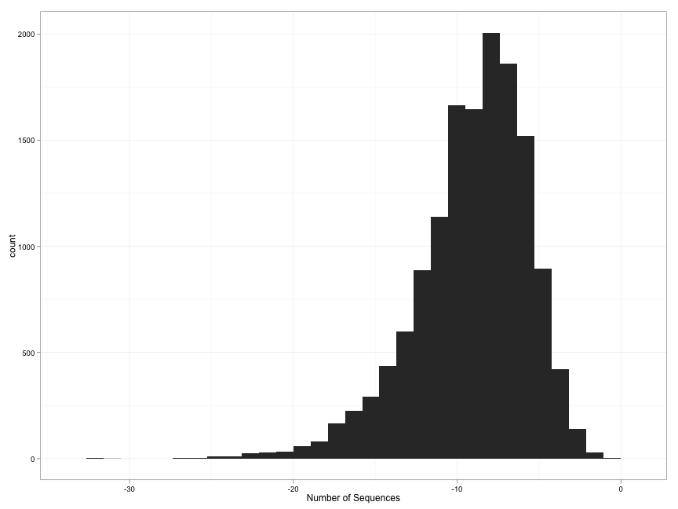 


Is there a correlation between secondary structure and transcript length (i.e. earlier TSS)?


```r
ggplot(ngs, aes(y = dG, x = Offset.RBS)) + geom_jitter(alpha = 0.1) + 
    theme_bw() + geom_density2d() + scale_x_continuous(name = "TSS relative to Barcode") + 
    scale_y_continuous(name = "Secondary Structure Free Energy")
```

 


Unclear, but there is a possible correlation. What about ribosome binding sites?


```r
ggplot(ngs, aes(y = dG, x = RBS, color = RBS)) + geom_boxplot(outlier.colour = NA) + 
    geom_jitter(alpha = 0.2) + theme_bw() + scale_x_discrete(name = "Ribosome Binding Site") + 
    scale_y_continuous(name = "Secondary Structure Free Energy")
```

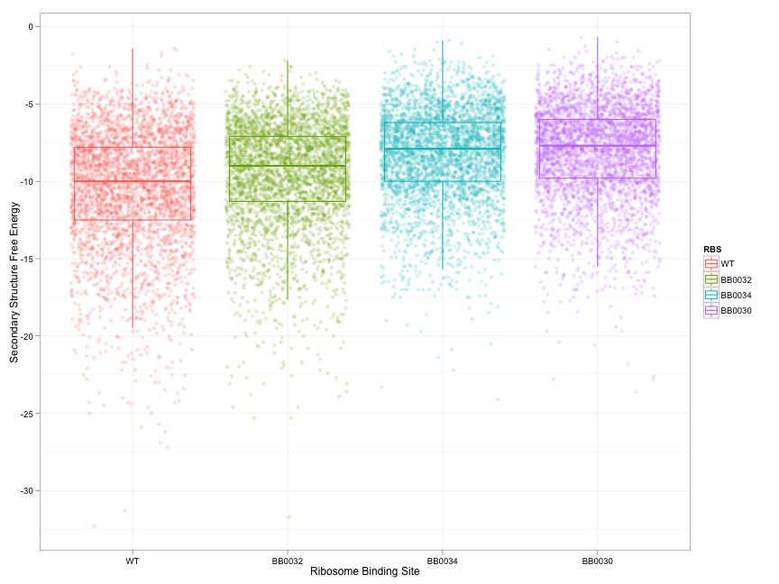 


What about correlation with GC content?


```r
ggplot(ngs, aes(y = dG, x = GC, color = RBS)) + geom_point(alpha = 0.08) + 
    theme_bw() + facet_wrap(~RBS, ncol = 2) + scale_x_continuous(name = "GC Content") + 
    scale_y_continuous(name = "Secondary Structure Free Energy")
```

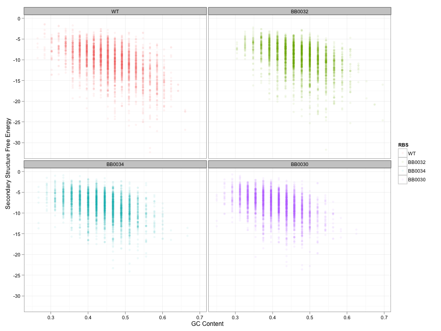 


There is a correlation here, so it will be interesting to see which has a better correspondence with transcription and translation, GC or free energy.

I need to do ANOVA to see which correlates better, or if it is an interaction. I did a few offline (`Anova(lm(log10(VAR) ~ Promoter + RBS +Gene + dG + GC, data=ngs), type=2)`) and it looks like **GC content has a stronger correlation** (higher Sum of Squares) for all 3 response variables (Prot, Trans, RNA) than dG, as least as I have computed it. I'll do this more thoroughly in a subsequent section.

## Transcript Secondary Structure and Expression

Let's split it up similar to the way we plotted GC content, first with the strong promoter, then with the weak one:


```r
ggplot(melt(subset(ngs, Promoter == "BBaJ23100"), measure.vars = c("RNA", 
    "Count.DNA", "Prot", "Trans")), aes(x = dG, color = RBS, y = value)) + geom_point(alpha = 0.05) + 
    theme_bw() + stat_smooth(method = lm, se = F) + facet_wrap(RBS ~ variable, 
    scale = "free") + scale_x_continuous(name = "Secondary Structure Free Energy") + 
    scale_y_log10("Log10 of Dependent Variable") + opts(title = "Free energy correlations (Strong Promoter)")
```

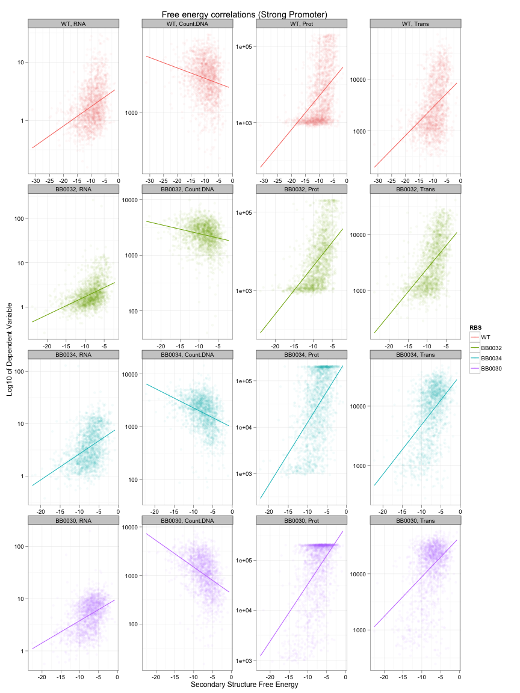 

```r

ggplot(melt(subset(ngs, Promoter == "BBaJ23108"), measure.vars = c("RNA", 
    "Count.DNA", "Prot", "Trans")), aes(x = dG, color = RBS, y = value)) + geom_point(alpha = 0.05) + 
    theme_bw() + stat_smooth(method = lm, se = F) + facet_wrap(RBS ~ variable, 
    scale = "free") + scale_x_continuous(name = "Secondary Structure Free Energy") + 
    scale_y_log10("Log10 of Dependent Variable") + opts(title = "Free energy correlations (Weak Promoter)")
```

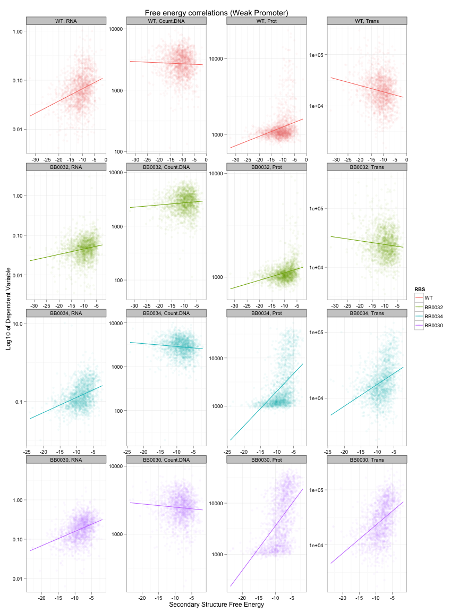 


There is an effect here, but I think there is something else confounding/mediating this effect. It is possible that there is a better (i.e. more correlated) way of calculating secondary structure. 

The mirrored 'L' shape makes it look that **low secondary structure (e.g. < -10) is necessary but not sufficient**, especially looking at Protein levels. 

It's possible that I need to calculate the secondary structure for more/less of the transcript, or look at windows to see where the most secondary structure lies. 

Next questions to ask:

* Does the correlation go up/down when I use more/less of the transcript to calculate delta-G?

* Does the strongest CDS sequence vary per RBS?  I could do that normalized per RBS or straight.

* How much does the secondary structure vary per CDS under different promoters?

* I could use UNAFold to see if the Shine-Dalgarno bases are paired/unpaired per sequence, and see if there is a stronger correlation there. 

* I could correlate expression with secondary structure for each N-bp window separately and see which correlation is the strongest. (40bp? 30bp? 20bp?)

* Finally, I can combine all of these things and use ANOVA-style analysis (ANCOVA/MANCOVA) to sort out what is really affecting what. 

## Exploring Secondary Structure along Sliding Windows

### Sliding windows for best and worst sequences

Let's check the sliding window secondary structure for the best and worst constructs (as far as measured protein abundance) with the 20 and 40 sliding windows:


```r
# boxplot across the best and worst 50 sequences, for each window position

plot_best_worst_windows <- function(window.df, num_lines, win_size) {
    
    window.bestProt <- subset(window.df, Name %in% head(ngs$Name[order(-ngs$Prot)], 
        num_lines))
    window.bestProt$Type <- paste("Best", num_lines)
    window.worstProt <- subset(window.df, Name %in% head(ngs$Name[order(ngs$Prot)], 
        num_lines))
    window.worstProt$Type <- paste("Worst", num_lines)
    
    title_str = paste("Secondary Structure ", win_size, "-mer Window for ", 
        num_lines, " Best/Worst Constructs", sep = "")
    
    ggplot(rbind(window.bestProt, window.worstProt), aes(x = Pos, y = dG, group = Name, 
        color = factor(Type))) + geom_line(alpha = 0.3) + opts(title = title_str)
}

plot_best_worst_windows(window.df.40, 50, 40)
```

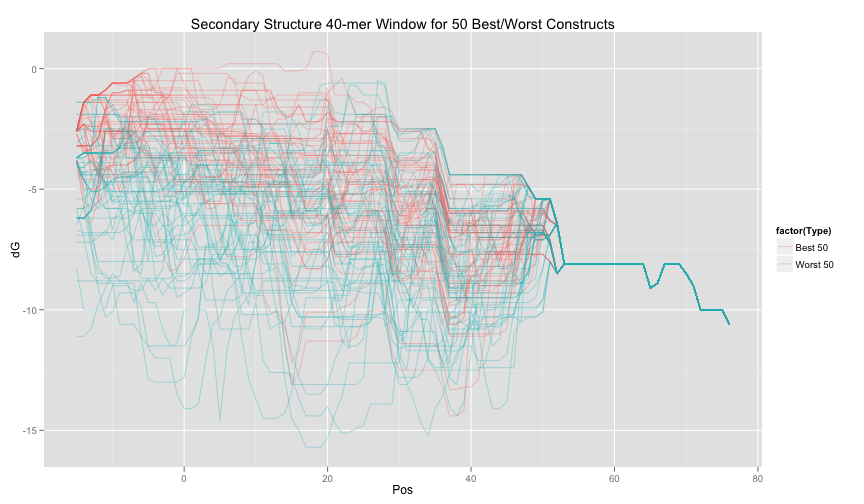 

```r
plot_best_worst_windows(window.df.20, 50, 20)
```

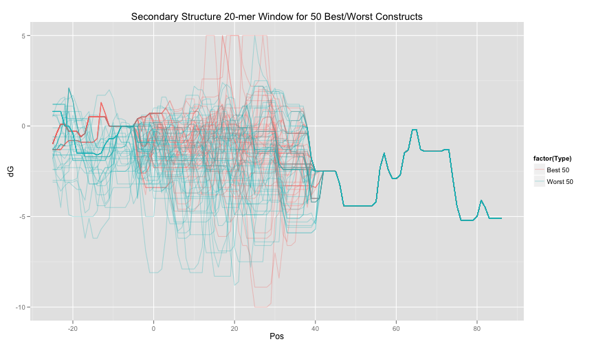 


Here are the secondary structure windows for the 50 best and worst sequences. Let's do some simple linear regression and see which window is best correlated to Protein level.

### Which window is best correlated?


```r
# merge windows with response variables
window.df.40 <- merge(window.df.40, ngs[, c("Prot", "RNA", "Trans", 
    "Name", "Promoter", "RBS", "Gene")], by = "Name")
window.df.20 <- merge(window.df.20, ngs[, c("Prot", "RNA", "Trans", 
    "Name", "Promoter", "RBS", "Gene")], by = "Name")


correlate_win <- function(df) {
    
    prot.lm <- lm(log10(Prot) ~ dG, data = df)
    rna.lm <- lm(log10(RNA) ~ dG, data = df)
    trans.lm <- lm(log10(Trans) ~ dG, data = df)
    
    return(data.frame(Prot.corr = summary(prot.lm)$r.squared, RNA.corr = summary(rna.lm)$r.squared, 
        Trans.corr = summary(trans.lm)$r.squared))
}

plot_window_correlation <- function(window.df, win_size) {
    
    window.corr <- ddply(window.df, .(Pos), correlate_win)
    window.corr <- melt(window.corr, id.vars = "Pos")
    names(window.corr) <- c("Pos", "Response", "value")
    
    window.corr.lines <- ddply(window.corr, c("Response"), summarize, Response.Max = Pos[which.max(value)], 
        Max = max(value))
    window.corr.lines$XPos <- c(40, 60, 80)
    
    ggplot(window.corr, aes(x = Pos, y = value, color = Response)) + geom_line() + 
        scale_x_continuous(name = "Window Center Positon relative to ATG") + 
        scale_y_continuous(name = paste("Linear Regression R-Squared for ", 
            win_size, "-bp Window", sep = "")) + theme_bw() + geom_vline(data = window.corr.lines, 
        alpha = 0.5, linetype = "dotted", aes(xintercept = Response.Max, colour = Response)) + 
        geom_text(data = window.corr.lines, aes(x = XPos, colour = Response, 
            label = Response.Max, y = -0.005), hjust = 1)
}

multiplot(plot_window_correlation(window.df.40, 40), plot_window_correlation(window.df.20, 
    20), cols = 1)
```

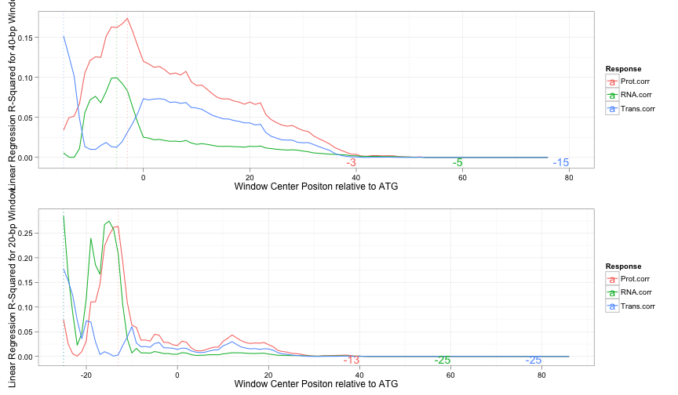 

```r

# Show the whole-transcript correlations to compare:
window.corr.compare <- summary(lm(log10(cbind(RNA, Prot, Trans)) ~ 
    dG, data = ngs))
```


I've drawn lines on and put the position of the maximum correlated window (40 bp, centered at that position). The peak appears to be strongest at -5/-6, corresponding to a window from -25 to +15 relative to ATG. 

For comparison, using secondary structure of the whole transcript gives:

* an RNA R-squared of **`0.1172`**
* a Protein R-squared of **`0.2294`**
* a Translation R-squared of **`0.0326`**

### Why is -13 the best 20bp window?

I'm surprised the correlation for the 20-bp window is so high; higher than the whole transcript score even. To check this, I'm going to plot the dG scores for the 20bp window at -13 position versus protein:


```r
ggplot(subset(window.df.20, Pos == -13), aes(y = log10(Prot), x = dG, 
    color = RBS, shape = Promoter)) + geom_jitter(alpha = 0.1, position = position_jitter(width = 0.2, 
    height = 0.2)) + theme_bw() + opts(title = "Prot vs dG for 20bp window centered at -13")
```

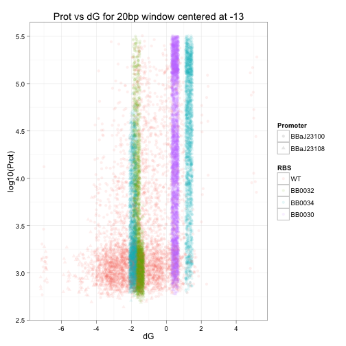 


So it is only classifying based on ribosome binding site identity; not that useful. for those three, but it could be a good classifier for the RBS itself, i.e. for telling wildtype RBS strength. It also picks up the fact that the interaction between the weak promoter and BB0034 increases secondary structure (decreases dG). 

### Sliding Window Correlation Separately for each RBS/Promoter

What happens when we split up these graphs for each RBS/Promoter?


```r

# function to correlate whole-transcript dG (for comparison)
correlate_whole_transcript <- function(df) {
    lm.xr.dG <- summary(lm(log10(cbind(Prot, RNA, Trans)) ~ dG, data = df))
    return(data.frame(Response = c("Prot.corr", "RNA.corr", "Trans.corr"), value = unlist(lapply(1:3, 
        function(i) lm.xr.dG[[i]]$r.squared)), YPos = c(11, 13, 15)/100))
}

plot_rbs_promo_window_corr <- function(window.df, win_size) {
    
    # correlate whole transcript dG for each promo/RBS
    xr.corr2 <- ddply(ngs, c("Promoter", "RBS"), correlate_whole_transcript)
    
    # generate correlations for each window, per Promo/RBS
    window.corr2 <- ddply(window.df, c("Pos", "Promoter", "RBS"), correlate_win)
    window.corr2 <- melt(window.corr2, id.vars = c("Pos", "Promoter", "RBS"))
    names(window.corr2) <- c("Pos", "Promoter", "RBS", "Response", "value")
    
    # get vertical line positions
    window.corr2.lines <- ddply(window.corr2, c("Response", "RBS", "Promoter"), 
        summarize, Response.Max = Pos[which.max(value)], Max = max(value))
    window.corr2.lines$XPos <- rep(c(40, 60, 80), each = 8)
    
    ggplot(window.corr2, aes(x = Pos, y = value, color = Response)) + geom_line() + 
        facet_grid(Promoter ~ RBS) + scale_x_continuous(name = "Window Center Positon relative to ATG") + 
        scale_y_continuous(name = paste("Linear Regression R-Squared for ", 
            win_size, "-bp Window", sep = "")) + theme_bw() + geom_vline(data = window.corr2.lines, 
        alpha = 0.5, linetype = "dotted", aes(xintercept = Response.Max, colour = Response)) + 
        geom_text(data = window.corr2.lines, aes(colour = Response, label = Response.Max, 
            y = -0.01, x = XPos), hjust = 1) + geom_text(data = xr.corr2, aes(colour = Response, 
        label = sprintf("%02.2f", value), y = YPos), x = 70)
}

plot_rbs_promo_window_corr(window.df.40, 40)
```

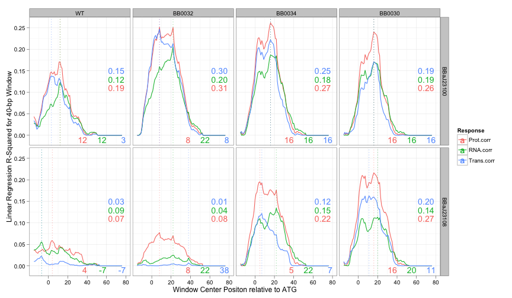 

```r
plot_rbs_promo_window_corr(window.df.20, 20)
```

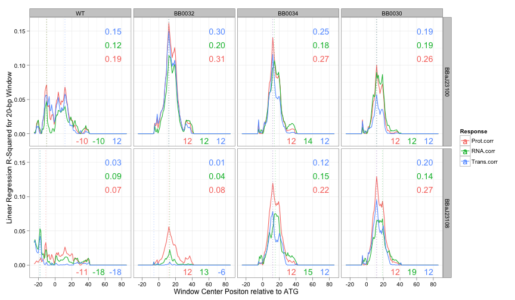 


The numbers in the upper right are the r-squared for the entire transcript dG. They are always higher; this means that taking the secondary structure of the whole 5' region of the transcript always correlates better than any single window. The windows do, however, tell you which *part* of the transcript has the secondary strucure. 

The numbers in the lower right are the positions of highest correlation (highest R-squared for the regression) for protein/translation/RNA. 

Some immediate take-aways:

* **All Promoters/RBSs seem to have two 'peak' positions where secondary structure matters most.** What does this correspond to, mechanistically?
* **Correlation is higher for the stronger promoter and stronger ribosome binding sites.** This makes sense intuitively. 
* **Protein has the best correlation, followed by translation, then RNA.** I'm surprised RNA correlates as much as it does, but it could be simply the positive effect that translation has on RNA stability. 

```


window.stats <- ddply(window.df, .(Name), summarize, 
    dG.Pos.min= Pos[which.min(dG)], 
    dG.min= min(dG), dG.avg= mean(dG), 
    dG.Pos.max= Pos[which.max(dG)], 
    dG.max= max(dG),
    dG.5prime.avg= mean(dG[which(Pos > -10 & Pos < 5)]),
    dG.5prime.max= max(dG[which(Pos > -10 & Pos < 5)]),
    dG.5prime.min= min(dG[which(Pos > -10 & Pos < 5)]))

ngs <- merge(ngs, window.stats, by='Name',all.x=T)
```

## 


