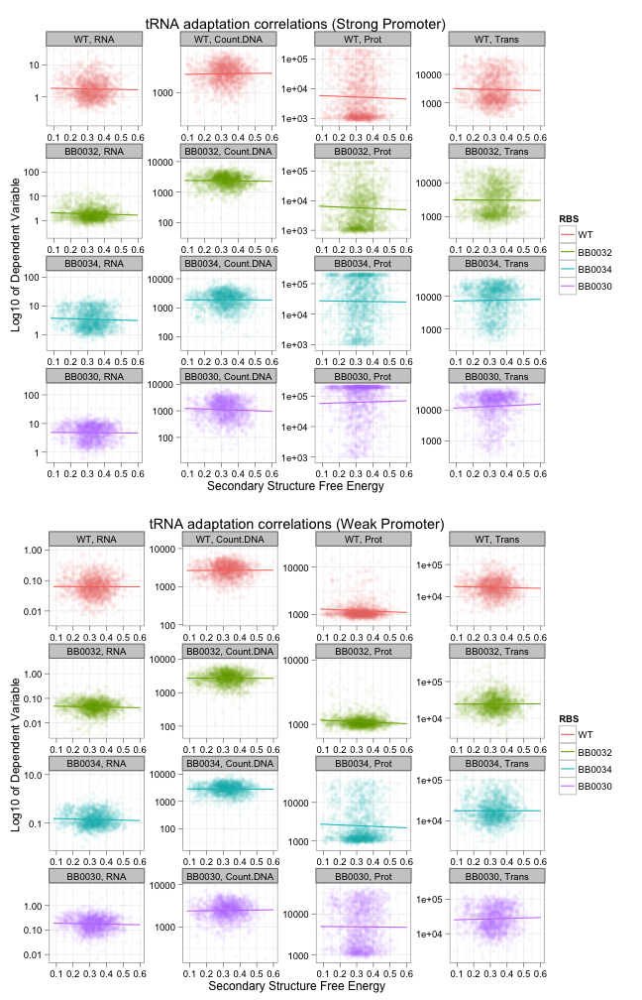
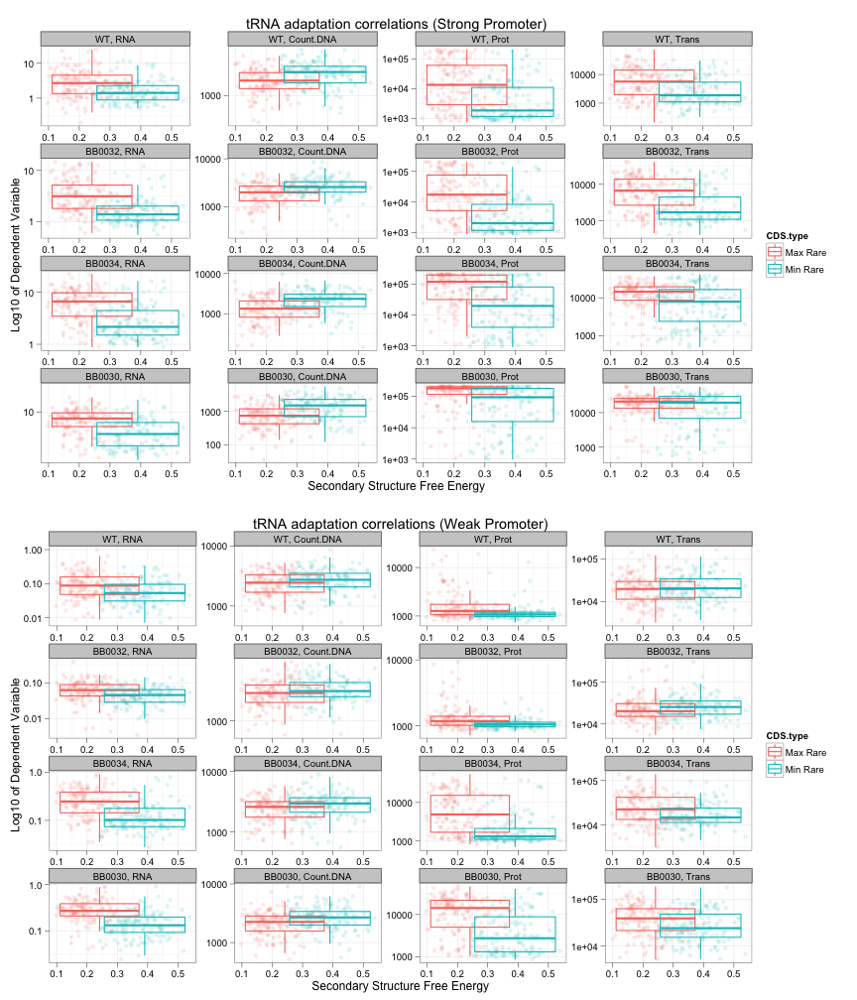
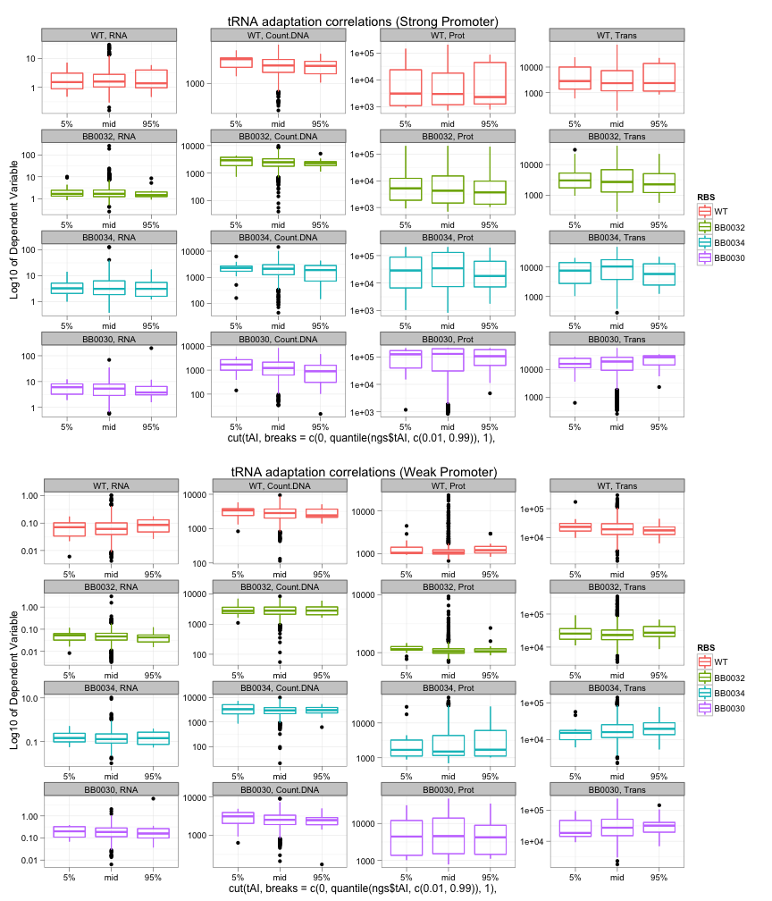

<link href="http://kevinburke.bitbucket.org/markdowncss/markdown.css" rel="stylesheet"></link>


# Step 07 - Looking at Codon and tRNA Adaptation Indices

## TAI Calcluation

I'm using [codonR](http://people.cryst.bbk.ac.uk/~fdosr01/tAI/codonR.tar.gz) to calculate tRNA adaptation for my constructs. I'm getting this first set of commands from `codonR/README`. 

I first had to run codonM on the coding sequence only, in perl. I also ran the same codonM script on the E. coli genome, for comparison.

```console
$ perl codonR/codonM \
    <(perl -pe '/^[ATGCatgc]/ && s/.*([ATGC]{33})/$1/' \
        data/203.norestrict.fa) \
    data/203.codonR.m
$ perl codonR/codonM codonR/ecolik12.ffn codonR/ecolik12.m
```


```r
source("codonR/tAI.R")
eco.trna <- scan("codonR/ecolik12.trna")
eco.ws <- get.ws(tRNA = eco.trna, sking = 1)
codonR.m <- matrix(scan("data/203.codonR.m"), ncol = 61, byrow = T)
codonR.m <- codonR.m[, -33]
tai <- get.tai(codonR.m, eco.ws)

# merge the tai scores with the gene names, and finally with NGS
names <- system("perl -ne \"/>/ && s/>// && print\" data/203.norestrict.fa", 
    intern = T)
ngs <- merge(ngs, data.frame(Name = names, tAI = as.numeric(tai)), 
    by = "Name")
```


OK, so now we can look at the correlation of tAI with expression level:


```r
multiplot(
    ggplot(melt(subset(ngs, Promoter=='BBaJ23100'), 
            measure.vars= c('RNA','Count.DNA','Prot','Trans')), 
            aes(x=tAI, color=RBS, y=value)) + 
        geom_point(alpha=0.05) + theme_bw() + stat_smooth(method=lm, se=F) +
        facet_wrap(RBS~variable, scale='free') +
        scale_x_continuous(name="Secondary Structure Free Energy") +
        scale_y_log10("Log10 of Dependent Variable") +
        opts(title="tRNA adaptation correlations (Strong Promoter)"),
    
    ggplot(melt(subset(ngs, Promoter=='BBaJ23108'), 
            measure.vars= c('RNA','Count.DNA','Prot','Trans')), 
            aes(x=tAI, color=RBS, y=value)) + 
        geom_point(alpha=0.05) + theme_bw() + stat_smooth(method=lm, se=F) +
        facet_wrap(RBS~variable, scale='free') +
        scale_x_continuous(name="Secondary Structure Free Energy") +
        scale_y_log10("Log10 of Dependent Variable") +
        opts(title="tRNA adaptation correlations (Weak Promoter)"),
cols=1)
```

 


I checked a few things to see if I did this right, because I expected to see a much larger effect. Maybe I should compare this by gene as well, so I will perform an ANOVA. 


```r
tai.lm <- lm(log10(Prot) ~ Promoter + RBS + Gene * tAI, data = ngs)
tai.aov <- Anova(tai.lm)
data.frame(Effect = rownames(tai.aov), Pct.Explained = tai.aov$"Sum Sq"/sum(tai.aov$"Sum Sq"))
```


```
##      Effect Pct.Explained
## 1  Promoter       0.30167
## 2       RBS       0.19841
## 3      Gene       0.13775
## 4       tAI       0.01045
## 5  Gene:tAI       0.01084
## 6 Residuals       0.34088
```


The effect is very very small; tAI seems to account for only about 1% of variance. I remember this being much larger! To shake my concerns about the data being calculated incorrectly (either by codonM, or by me), I will plot the data like I did earlier, in a large grid by gene, cds type, promoter, and RBS. 


```r
ggplot(ngs, aes(x = reorder(Gene, log10(Prot), mean), y = CDS.type)) + 
    geom_tile(aes(fill = rescale(log10(Prot), c(-1, 1)))) + opts(panel.background = theme_rect(fill = "gray80"), 
    axis.ticks = theme_blank()) + scale_fill_gradient2(low = "darkred", mid = "yellow", 
    high = "darkgreen") + facet_grid(RBS ~ Promoter) + opts(plot.title = theme_text(size = 14, 
    lineheight = 0.8, face = "bold"), legend.position = FALSE, axis.text.x = theme_text(angle = -90))
```

 


The effect is there and definitely quite strong. We can check and see if TAI is correctly measured:


```r

ngs$Gene <- with(ngs, reorder(Gene, log10(Prot), mean))

ggplot(subset(ngs, Promoter == "BBaJ23100" & RBS == "BB0032"), aes(x = Gene, 
    y = CDS.type)) + geom_tile(aes(fill = tAI)) + opts(panel.background = theme_rect(fill = "gray80"), 
    axis.ticks = theme_blank()) + scale_fill_gradient2(low = "blue", mid = "beige", 
    high = "red", midpoint = mean(ngs$tAI), limits = range(ngs$tAI)) + opts(plot.title = theme_text(size = 14, 
    lineheight = 0.8, face = "bold"), axis.text.x = theme_text(angle = -90))
```

 


It looks correctly measured and it also looks like quite a strong correlation! In addition to the 'max rare' codon variants all having very low tAI, it looks like the first ~1/4 of the genes with the lowest expression (X axis is sorted by mean Protein level) all have lower tAIs. 

So why are the trend lines so flat? Let's look at just the min and max codons:


```r
multiplot(
    ggplot(melt(subset(ngs, 
            Promoter=='BBaJ23100' & grepl('Rare',ngs$CDS.type)), 
            measure.vars= c('RNA','Count.DNA','Prot','Trans')), 
            aes(x=tAI, group=CDS.type, color=CDS.type, y=value)) + 
        geom_point(alpha=0.15) + theme_bw() +
        facet_wrap(RBS~variable, scale='free') +
        scale_x_continuous(name="Secondary Structure Free Energy") +
        scale_y_log10("Log10 of Dependent Variable") +
        opts(title="tRNA adaptation correlations (Strong Promoter)") +
        geom_boxplot(fill=NA, outlier.shape=NA),
    
    ggplot(melt(subset(ngs, 
            Promoter=='BBaJ23108' & grepl('Rare',ngs$CDS.type)), 
            measure.vars= c('RNA','Count.DNA','Prot','Trans')), 
            aes(x=tAI, group=CDS.type, color=CDS.type, y=value)) + 
        geom_point(alpha=0.15) + theme_bw() +
        facet_wrap(RBS~variable, scale='free') +
        scale_x_continuous(name="Secondary Structure Free Energy") +
        scale_y_log10("Log10 of Dependent Variable") +
        opts(title="tRNA adaptation correlations (Weak Promoter)") +
        geom_boxplot(fill=NA, outlier.shape=NA),
cols=1)
```

 


Alright, there is an effect here, but **why is it so strong for RNA?**. The max protein measurement might be washing out the effect, perhaps? Or the fitness cost makes the cells divide more slowly, increasing the amount of RNA per cell? Something weird is definitely going on here. I split the tAI into regions and plot it with boxplots:


```r
multiplot(ggplot(melt(subset(ngs, Promoter == "BBaJ23100"), measure.vars = c("RNA", 
    "Count.DNA", "Prot", "Trans")), aes(y = value, x = cut(tAI, breaks = 5), 
    color = RBS)) + geom_boxplot(alpha = 0.15) + theme_bw() + facet_wrap(RBS ~ 
    variable, scale = "free") + opts(title = "tRNA adaptation correlations (Strong Promoter)") + 
    scale_y_log10("Log10 of Dependent Variable") + geom_boxplot(fill = NA, outlier.shape = NA), 
    ggplot(melt(subset(ngs, Promoter == "BBaJ23108"), measure.vars = c("RNA", 
        "Count.DNA", "Prot", "Trans")), aes(y = value, x = cut(tAI, breaks = 5), 
        color = RBS)) + geom_boxplot(alpha = 0.15) + theme_bw() + facet_wrap(RBS ~ 
        variable, scale = "free") + opts(title = "tRNA adaptation correlations (Weak Promoter)") + 
        scale_y_log10("Log10 of Dependent Variable") + geom_boxplot(fill = NA, 
        outlier.shape = NA), cols = 1)
```

 


So it looks like max/min is a strong effect but when I include the tAI measures for all sequences, the effect is not very strong (though still significant) when I include sequences not explicitly designed to have a high rare codon usage. What if we split it up into the extremes, the 1% and 99% quantiles: 


```r
multiplot(ggplot(melt(subset(ngs, Promoter == "BBaJ23100"), measure.vars = c("RNA", 
    "Count.DNA", "Prot", "Trans")), aes(y = value, x = cut(tAI, breaks = c(0, 
    quantile(ngs$tAI, c(0.01, 0.99)), 1), labels = c("5%", "mid", "95%")), color = RBS)) + 
    geom_boxplot(alpha = 0.15) + theme_bw() + facet_wrap(RBS ~ variable, scale = "free") + 
    opts(title = "tRNA adaptation correlations (Strong Promoter)") + scale_y_log10("Log10 of Dependent Variable") + 
    geom_boxplot(fill = NA, outlier.shape = NA), ggplot(melt(subset(ngs, Promoter == 
    "BBaJ23108"), measure.vars = c("RNA", "Count.DNA", "Prot", "Trans")), aes(y = value, 
    x = cut(tAI, breaks = c(0, quantile(ngs$tAI, c(0.01, 0.99)), 1), labels = c("5%", 
        "mid", "95%")), color = RBS)) + geom_boxplot(alpha = 0.15) + theme_bw() + 
    facet_wrap(RBS ~ variable, scale = "free") + opts(title = "tRNA adaptation correlations (Weak Promoter)") + 
    scale_y_log10("Log10 of Dependent Variable") + geom_boxplot(fill = NA, outlier.shape = NA), 
    cols = 1)
```

 


